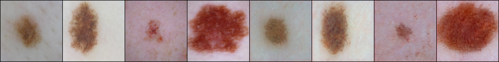

## Detection d'anomalies dans les images de lésions cutanées Implémentation avec Pytorch

## Avertissements et recommandations

Ce projet utilise une partie du code provenant du projet du groupe NVIDIA sur le [StyleGAN2 et 3](https://github.com/NVlabs/stylegan3/tree/main) . Veuillez lire attentivement ses conditions d'utilisation. Sa réutilisation est faite dans le present cas, UNIQUEMENT pour la recherche. Veuillez lire la [Licence utilisateur](https://github.com/NVlabs/stylegan3/blob/main/LICENSE.txt) du projet d'origine.
Pour reimplémenter le présent travail, il faut:
- cloner le projet original à partir du GitHub officiel du stylegan2 et 3 ci-dessus;
- remplacer le fichier `networks_stylegan2` original (présent dans le répertoire `training` du [StyleGAN2 et 3](https://github.com/NVlabs/stylegan3/tree/main) ) par celui se trouvant ici;
- Ajouter tous les fichiers `.py` de ce repo dans le répertoire principal que vous venez de cloner;
- Configurer l'environnement à l'aide du fichier `environment.yml` déjà cloné.

## Préparation des données.

Il faut se reférer aux indications du GitHub officiel du StyleGAN3 pour éventuelles adaptation. Dans le cadre de ce projet, les données ont été mises en forme à l'aide du script ci-dessous, que vous exécutez dans votre IDE:
`python dataset_tool.py --source=dataset/train_set/NEV --dest=trainset \`
`    --transform=center-crop --resolution='256x256`
- "source" est le dossier où sont stockées les images brutes;
- "dest" est le dossier dans lequel les images seront stoquées, après la mise en forme et les différentes opérations de prétraitement choisies;

## Entrainement du styleGAN2-ada par transfert d'apprentissage
`python train.py --outdir=training-runs --cfg=stylegan2 --data=train_set \`
`    --gpus=1 --batch=16 --gamma=0.8192 --map-depth=2 --glr=0.0025 --dlr=0.0025\`
`    --cbase=16384  --kimg=50 --snap=5 --workers=2\`
`    --resume=https://api.ngc.nvidia.com/v2/models/nvidia/research/stylegan2/versions/1/files/stylegan2-ffhq-256x256.pkl`
- "train_set" est le dossier où sont stockées les images précédemment prétraitées;
- "training-runs" est le dossier dans lequel les les poids du modèle seront sauvegardés, durant la phase d'entraînement;
- "resume" est la variable contenant le lien qui permet de charger les poids du réseau pré-entrainés qu'on a choisi;

## Entrainement de l'encodeur
Pour entrainer l'encodeur, il faut exécuter le script `python train_encoder.py` . Ceci est possible si vous avez déjà remplacer le fichier [networks_stylegan2] original, par celui présent ici, dans le dossier "training-runs";
Vous pouvez également modifier le nombre d'itérations, ainsi que la fréquence à laquelle les poids de l'encodeur seront sauvegardés, en fonction de la puissance de calcul de votre matériel.

<a href="./checkpointed/rec499.png"></img></a>

## Reconstruction d'images'

le fichier `generate_pic.py` permet de générer les images à partir d'un dossier spécifié. Chaque image sera reconstruite après passage à travers l'encodeur et le générateur du GAN.
Les images reconstruites seront sauvegardées dans un nouveau dossier appelé `generated_img` , chacune ayant le nom de l'image d'origine.

## Calcul des scores d'anomalies

Plusieurs distances ont permis de calculer les scores d'anomalie. Ces scores sont stockés sous formes de fichiers excels, avec deux colonnes: "score" et "label". Ils peuvent ainsi être facilement reutilisés comme des dataframes.
Vous pouvez utiliser:
- `mean_score_izif.py` pour calculer le score d'anomalie selon la méthode izif;
- `mean_score_a05.py` pour calculer les scores d'anomalies selon différentes distances implémentées dans la bibliothèque Sci-kit Learn;
- `mean_score_torchpd.py` pour calculer les scores d'anomalie selon la norme euclidienne, implémentée dans la bibliothèque `nn.functional` de Pytorch.

## Visualisation de l'espace latent

L'une des méthodes utilisées pour transformer les données à plusieurs dimensions dans un espace permettant sa compréhension par l'esprit humain est le t-SNE. Il est possible de projetter des images en entrée de l'encodeur dans l'espace latent, et de les visualiser. Pour ce faire exécutez le fichier `tSNE.py`.

## Evaluation du classifieur semi-supervisé.

L'exécution du script `classifier2.py` permet d'evaluer le modèle en utilisant comme métriques la précision, le rappel, le score f1. Ce script permet également de tracer les graphiques de comparaison des scores de naevus VS melanomes, les graphiques de matrices de confusion, les rapports de classification ainsi que les A.U.C et les stocke dans un nouveau dossier nommé "graphics".
Il faudra modifier les les noms des fichiers excels contenants vos scores d'anomalie, en fonction des vôtres.

<a href="./graphics/confMatrix_pd05.png"></img></a>

<a href="./graphics/violon_pd05.png"></img></a>

<a href="./graphics/roc_pd05.png"></img></a>

<a href="./graphics/report_pd05.png"></img></a>

### Auteur
SAmuel Fabrice NCHARE
